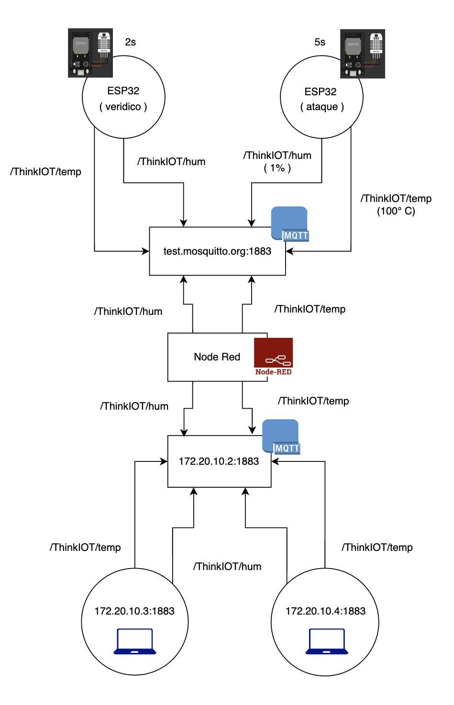
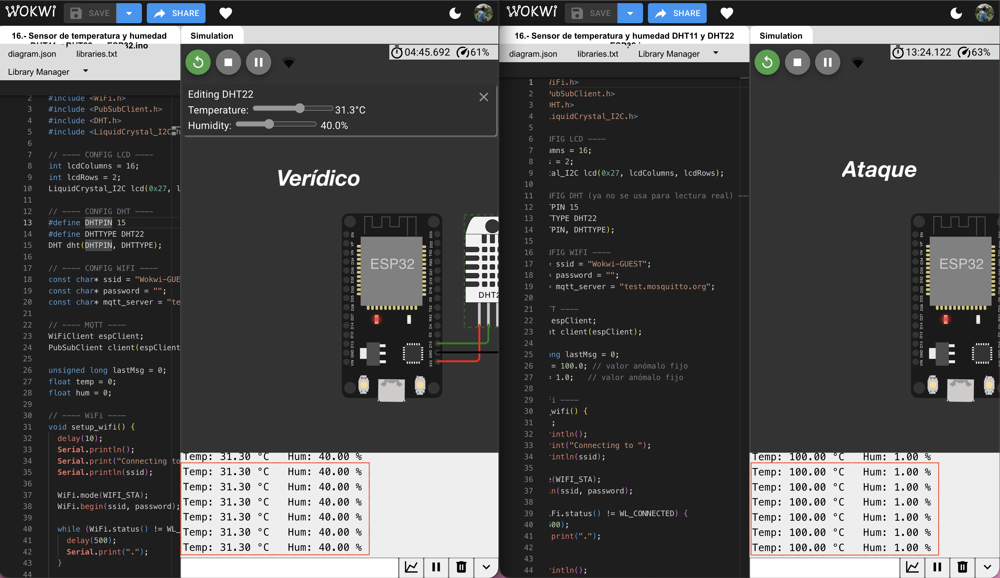
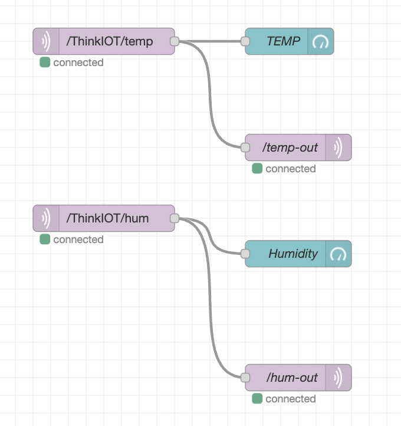
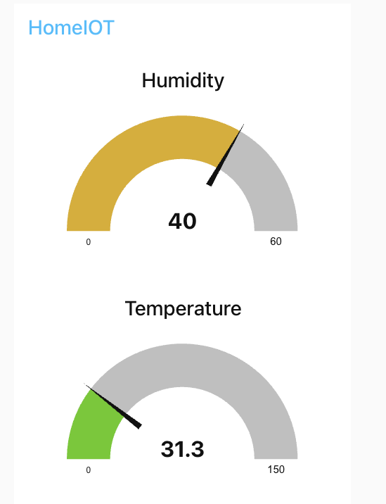
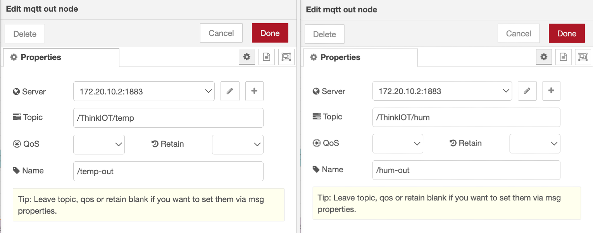
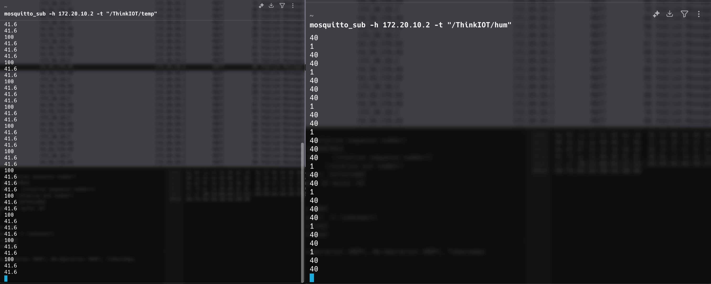
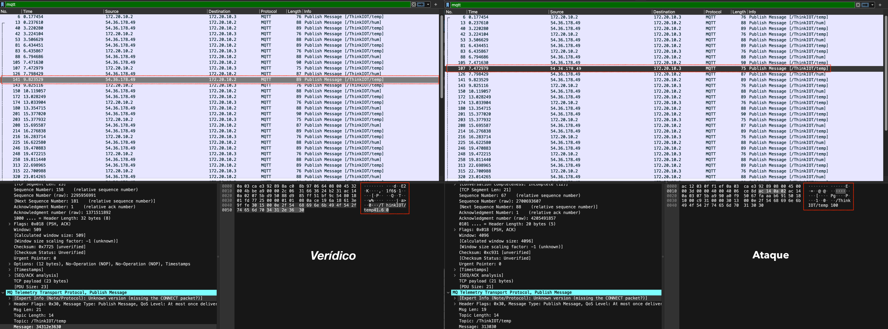
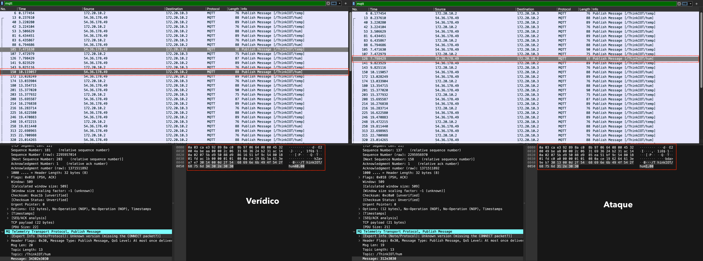
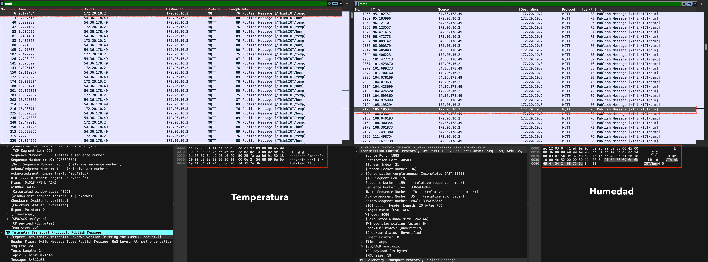

# Laboratorio 04: Iot Security

En esta experiencia estaremos replicando la comunicación de dispositivos ESP32 [1] hacia un servidor MQTT [2] ejecutado a través Eclipse Mosquito [3], un broker MQTT. En ello, insertaremos un nodo ESP32 que envía señales anómalas simulando la inserción de un ataque en esta comunicación de internet de las cosas.

En sí la implementación se ve como en la imagen de abajo. A manera de overview, básicamente un par de nodos ESP32 enviando señales a un servidor MQTT proveído por Wokwi [4], ello recepcionado por el software Node-RED [5] y redirigido a otro servidor MQTT dentro de una red local para ser accedido por dispositivos dentro de esta. Revisaremos cada paso de esta implementación, la probaremos y adicionalmente plantearemos algunas medidas de seguridad al igual que extraeremos conclusiones. Se dejará una demostración de todo la arquitectura funcionando.



## Implementación

Básicamente revisamos la implementación de cada parte de la arquitectura presentada anteriormente. Desde el envío de señales de los ESP32, hasta la lectura de las señales por parte de dispositivos dentro de la misma red local.

---

### ESP32: Wokwi

Wokwi solo puede enviar señales a un servidor MQTT dedicado, en este caso `test.mosquitto.org:1883`. Tenemos, como se ve en la imagen, un nodo verídico que envía señales de temperatura y humedad simuladas, y uno atacante que manda estas señales tambien pero con valores extremos o anómalos. 



Para ambos nodos, las señales se envían con los siguientes tópicos:

- ```Temperatura: /ThinkIOT/temp```
- ```Humedad: /ThinkIOT/hum```

Y se conectan al servidor MQTT de esta manera:

```c
const char* ssid = "Wokwi-GUEST";
const char* password = "";
const char* mqtt_server = "test.mosquitto.org";
```

Con ello podemos revisar cada nodo específicamente.

---

#### Verídico

Este nodo básicamente lee los valores de la temperatura y humedad a través de un sensor simulado, y cada dos segundos envía las señales al servidor MQTT dedicado. Hace ello a través de esta función `loop`.

```c
    void loop() {
      if (!client.connected()) reconnect();
      client.loop();

      unsigned long now = millis();
      if (now - lastMsg > 2000) { 
        lastMsg = now;

        hum = dht.readHumidity();
        temp = dht.readTemperature();

        if (isnan(hum) || isnan(temp)) {
          lcd.clear();
          lcd.setCursor(0,0);
          lcd.print("Error sensor!");
          Serial.println("Falla en sensor DHT");
          return;
        }

        client.publish("/ThinkIOT/temp", String(temp, 2).c_str());
        client.publish("/ThinkIOT/hum", String(hum, 2).c_str());
      }
    }
```

Puede revisar el código completo en `veridico.c`

---

#### Ataque

Este nodo declara valores fijos anómalos para temperatura y humedad de esta manera:

    float temp = 100.0;
    float hum  = 1.0;

Cada cinco segundos envía señales al mismo servidor MQTT que el nodo verídico. Aumentamos el tiempo entre envíos para simular envíos anómalos. Se hace de esta manera:

```c
    void loop() {
      if (!client.connected()) reconnect();
      client.loop();

      unsigned long now = millis();
      if (now - lastMsg > 5000) {
        lastMsg = now;

        client.publish("/ThinkIOT/temp", String(temp, 2).c_str());
        client.publish("/ThinkIOT/hum", String(hum, 2).c_str());

        Serial.print("Temp: "); Serial.print(temp); Serial.print(" °C   ");
        Serial.print("Hum: "); Serial.print(hum); Serial.println(" %");
      }
    }
```

Puede revisar el código completo en `ataque.c`

---

### Servidor MQTT

Debemos levantar el servidor MQTT al que redirigiremos las señales recibidas en `test.mosquitto.org:1883`. Esta experiencia fue desarrollada en un entorno macOS. Por tanto levantamos el servidor con:

```bash
brew services start mosquitto
```

---

### Node-RED

El diagrama utilizado en Node-RED sigue la estructura que se ve en la imagen de abajo. Básicamente obtenemos las señales de temperatura y humedad enviadas a `test.mosquitto.org:1883`, y son redirigidas a `172.20.10.2:1883`.



Adicionalmente añadimos una dashboard para visualizar la recepción de las señales como se ve en la siguiente imagen.



Básicamente se tiene dos entradas `mqtt-in` que reciben los tópicos `/ThinkIOT/temp` y `/ThinkIOT/hum` como se ve en la siguiente imagen.


Y se redirigen bajo los mismos tópicos con `mqtt-out` como se ve en la siguiente imagen.



---

### Recepción de señales

Una vez redirigidas las señales de temperatura y humedad a `172.20.10.2:1883`, comprobamos que hayan sido enviadas mediante los siguientes comandos:

```bash
mosquitto_sub -h 172.20.10.2 -t "/ThinkIOT/temp"
mosquitto_sub -h 172.20.10.2 -t "/ThinkIOT/hum"
```

Para esta etapa se comprueba con la misma IP que levanta el servidor, pero más adelante veremos que otros dispositivos dentro de la red local pueden acceder. Se puede ver cómo se obtienen las señales de temperatura y humedad en la siguiente imagen. Vemos que para cada señal se obtienen los valores anómalos con menos frecuencia, simulando la amenaza.



Adicionalmente, a través de Wireshark [6], un software de código abierto para lectura de redes, podemos comprobar que las señales efectivamente se envían de `test.mosquitto.org:1883`, con IP `53.36.178.49`, hacia `172.20.10.2`. Podemos ver cómo se hace la lectura tanto de una señal verídica y anómala para `/ThinkIOT/temp` en la siguiente imagen:



Como para `/ThinkIOT/hum` en la siguiente imagen:



## Pruebas y experimentación

Se prueba que la implementación anterior sea accesible dentro de la red local.  
El servidor MQTT está levantado en `172.20.10.2:1883`, y por lo tanto debería ser accesible por dispositivos dentro de la red local `172.20.10.0/24`.

---

### Reconocimiento y enumeración

Debemos escanear la red local para reconocer los dispositivos conectados.  
Ejecutamos el siguiente comando:

```bash
sudo nmap -sn -v 172.20.10.0/24
```

Y obtenemos el siguiente resultado:

```
Starting Nmap 7.95 ( https://nmap.org ) at 2025-11-05 11:59 -05
Initiating ARP Ping Scan at 11:59
Scanning 15 hosts [1 port/host]
Completed ARP Ping Scan at 12:00, 1.77s elapsed (15 total hosts)
Initiating Parallel DNS resolution of 3 hosts. at 12:00
Completed Parallel DNS resolution of 3 hosts. at 12:00, 0.03s elapsed
Nmap scan report for 172.20.10.0 [host down]
Nmap scan report for 172.20.10.1
Host is up (0.011s latency).
MAC Address: 8A:C0:8B:97:06:64 (Unknown)
Nmap scan report for 172.20.10.3
Host is up (0.29s latency).
MAC Address: AC:12:03:0F:F1:EF (Intel Corporate)
Nmap scan report for 172.20.10.4
Host is up (0.30s latency).
….
```

Por lo tanto, tenemos dos hosts levantados:

- ```172.20.10.3```
- ```172.20.10.4```

---

### Escaneo

Del reconocimiento anterior, escogemos el host ```172.20.10.3``` y lo escaneamos para identificar algunos servicios como HTTP, HTTPS y SSH. Ejecutamos el siguiente comando:

```bash
sudo nmap -p 22,80,443 172.20.10.3
```

Y obtenemos el siguiente resultado:

```
Starting Nmap 7.95 ( https://nmap.org ) at 2025-11-05 12:11 -05
Nmap scan report for 172.20.10.3
Host is up (0.067s latency).

PORT    STATE    SERVICE
22/tcp  filtered ssh
80/tcp  filtered http
443/tcp filtered https
MAC Address: AC:12:03:0F:F1:EF (Intel Corporate)

Nmap done: 1 IP address (1 host up) scanned in 1.82 seconds
```

Vemos que los puertos respectivos son ``22``, ``80`` y ``443``, con una dirección MAC de ``AC:12:03:0F:F1:EF``. Adicionalmente comprobamos que es una máquina Intel.

---

### Conexión a servidor MQTT

Comprobamos entonces que el host ``172.20.10.3`` puede conectarse al servidor MQTT hosteado en ```172.20.10.2``` a través de lecturas en Wireshark. En la siguiente imagen vemos cómo se realiza la lectura de ```/ThinkIOT/temp``` y ```/ThinkIOT/hum``` desde ```172.20.10.2``` hacia ```172.20.10.3```. De esta manera comprobamos que funciona correctamente nuestra implementación.



---

## Técnicas de mitigación y verificación

A partir de esta implementación, revisaremos la factibilidad de adoptar ciertas medidas de seguridad, principalmente de mitigación y verificación. Como próxima etapa, se podría implementar alguna de estas para tratar de evitar la amenaza propuesta en esta experiencia.

---

### TLS y conexiones seguras

Transport Layer Security [7] es un protocolo criptográfico que nos provee cifrado, autenticación e integridad en el envío de información a través de la red. Usa conceptos de encriptación pública, firmas digitales y certificados.  

Por tanto, resultaría pertinente adaptarlo. A través de una firma, y también certificados, podríamos verificar la veracidad de las señales recibidas en el servidor MQTT, rechazando las anómalas. Ello puede complementarse con encriptación, para así evitar posibles lecturas no deseadas de las señales.  

Sin embargo, el proceso de firmar y encriptar añadiría *overhead*, además de un *payload* más grande, por lo que habría que encontrar un punto medio entre seguridad y factibilidad.

---

### Autenticación y ACL por tópico

Retomando lo anterior, la autenticación resulta pertinente, pero aumenta el *overhead* y el *payload* enviado, por lo que se debe hallar un punto medio entre seguridad y rapidez.  

Sobre el **Access Control List (ACL)** [8], se refiere a definir ciertas reglas para determinar los permisos de un cliente MQTT. Por ejemplo, qué nodos pueden publicar o leer señales.  

Ello podría ayudar si, por ejemplo, el ataque se centrara en corromper algún nodo y cambiar su funcionalidad, como publicar alguna otra señal.  

Incluso podría ser útil en este caso, pero supongamos que este ataque duplica el nodo verídico, con sus permisos y demás, pero solo cambia el valor de la señal. Ahí pierde un poco de utilidad.

---

### Revisar y validar payloads

En este caso, revisar *payloads* no resulta tan útil como medida de seguridad, ya que no estamos propiamente haciendo alguna operación con las señales, sino meramente recibiéndolas y leyéndolas.  

En un entorno más real, en el que, por ejemplo, se reportan estas señales, resultaría importante validar cada señal recibida, y por tanto descartar valores anómalos como 1% de humedad o 100°C de temperatura, como en el caso propuesto.  

Sin embargo, esta validación adicional añadiría *overhead*.

---

### Limitar rate de publicación

Limitar la tasa de publicación por dispositivo o incluso por tópico (por ejemplo, `/ThinkIOT/temp`) no sería tan efectivo en este caso.  

El motivo es que aquí no se está realizando *spam* hacia el servidor MQTT, sino enviando señales anómalas con una frecuencia baja.  

Por lo tanto, establecer un límite de publicación podría no evitar las señales maliciosas y, en cambio, podría provocar la pérdida de mensajes legítimos si no conociéramos el ritmo real de envío del dispositivo.  

En este escenario, resulta más sensato monitorear y validar las entradas para detectar comportamientos anómalos, en lugar de depender únicamente de un control de *rate-limit*.

---

### Monitorear logs y desplegar IDS/IPS

Implementar una arquitectura para monitorear logs y ver amenazas, para una implementación IoT tan simple como esta, resulta viable pero en cierta medida ilógico.  

Se estaría a cierto nivel duplicando en complejidad la arquitectura MQTT solo para monitoreo. Esto va de la mano con el despliegue de **Intrusion Detection System (IDS)** [9] e **Intrusion Prevention System (IPS)** [9].  

Finalmente, estos están referidos a detectar amenazas y, más complejo aún, a prevenirlas.  

En este caso, monitoreo y detección es viable, pero la prevención resulta más costosa y difícil de implementar.

---

### Inventario de dispositivos y parches de firmware

Mantener un inventario de dispositivos puede ser útil si cada uno envía una señal diferente. Por ejemplo, si alguna señal se ve comprometida, podemos ligarla a su respectivo nodo o dispositivo.  

En cuanto a **parches de firmware** [10], también es útil, pero al menos en este caso no tanto, porque no estamos comprometiendo el software de control, sino duplicando un nodo con una amenaza.  

Aunque apliquemos un parche, este nodo duplicado no desaparecerá.


## Conclusiones y recomendaciones

Finalizada esta experiencia, se ha planteado una arquitectura de comunicación basada en MQTT, en la cual se logró insertar y simular una amenaza típica: el nodo duplicado.  

Se revisó el flujo completo de transmisión, desde el envío de señales por parte de dos ESP32 hacia el servidor público `test.mosquitto.org:1883`, hasta su recepción en el servidor local desplegado en `172.20.10.2` y accedido por otros dispositivos dentro de la red interna.  

La ausencia de medidas de seguridad evidenció cómo una amenaza aparentemente sencilla puede ser implementada e introducida sin mayores dificultades.  

En el contexto del Internet de las Cosas y del uso de MQTT como protocolo de comunicación, surge el dilema entre mantener sistemas ligeros, rápidos y simples, o priorizar mecanismos de seguridad robustos y eficaces.  

La naturaleza de este tipo de comunicación busca ser ágil, continua y poco interrumpida, lo cual con frecuencia conduce a omitir o minimizar consideraciones de seguridad. Sin embargo, como se ha demostrado en esta experiencia, estas decisiones dejan abiertas puertas a amenazas y ataques.  

El propósito de este ejercicio fue precisamente identificar y reflexionar sobre el equilibrio necesario entre eficiencia y seguridad en sistemas IoT basados en MQTT.


## Demostración

Se deja un pequeño video demostrando la implementación: [Video](https://drive.google.com/file/d/1Nh-R5MqHx4Wk6F-rCyA29kFaWx3EZwkU/view?usp=sharing)  

> Note que en la última parte se notan mediciones de temperatura y humedad no generadas por nosotros. Es posible que otra persona esté enviando señales bajo la misma trama o tópico, y como jalamos de `test.mosquitto.org:1883`, un servidor público, es posible que se capturen estas señales.

---

## Referencias

1. Guerra Carmenate, J. (n.d.). ESP32 Wifi y Bluetooth en un solo chip. Recuperado de https://programarfacil.com/esp8266/esp32/
2. MQTT.org. (s.f.). MQTT: The standard for IoT messaging. Recuperado de https://mqtt.org/
3. Eclipse Mosquitto. (s.f.). An open-source MQTT broker. Recuperado de https://mosquitto.org/
4. Wokwi. (s.f.). ESP32 simulation page. Recuperado de https://wokwi.com/esp32/
5. Node‑RED. (s.f.). Low-code programming for event-driven applications. Recuperado de https://nodered.org/
6. Wireshark. (s.f.). Go Deep – the world’s foremost and widely-used network protocol analyzer. Recuperado de https://www.wireshark.org/
7. Jonker, A., & Krantz, T. (s.f.). ¿Qué es Transport Layer Security (TLS)? IBM Think. Recuperado de https://www.ibm.com/es-es/think/topics/transport-layer-security
8. Heimdall Security. (2024, 5 de diciembre). What Is an Access Control List (ACL)? Heimdall Security. Recuperado de https://heimdalsecurity.com/blog/what-is-an-access-control-list-acl/
9. Hewlett Packard Enterprise. (2025, 5 de marzo). ¿Qué son los sistemas IDS e IPS? HPE LAMERICA. Recuperado de https://www.hpe.com/lamerica/es/what-is/ids-ips.html
10. Fortinet. (s.f.). What Is Firmware? Types and Examples. Recuperado de https://www.fortinet.com/resources/cyberglossary/what-is-firmware


